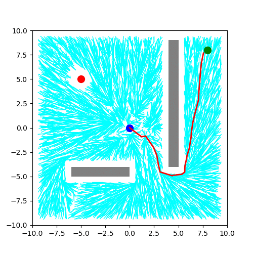
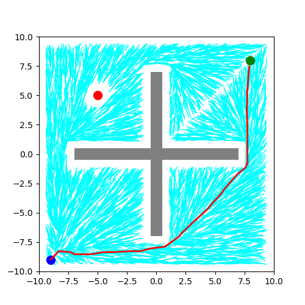

# Modified-RRT-star-for-dynamic-path-planning
Refer the Final_report for the complete description of the project.

Map 1

Map 2

# Usage
There are two main files for 2 different maps considered

dynamic_path_planning_map1.py

1) The same file can be used to test pure reconnect, pure regrow and dynamic scenario.
2) Only one fucntion can be run at once so uncomment the one which is to be tested in the last lines of the file.
3) The correspondong plots will be stored in Plots_map1 folder.
4) Clear these folder before evrytime the main file is tested.
5) The initial tree is built and stored in the pickle file as rrt_map1.pkl. 
If this file is missing then the entire tree will be built from scratch.

dynamic_path_planning_map2.py

1) The same file can be used to test pure reconnect, pure regrow and dynamic scenario.
2) Only one fucntion can be run at once so uncomment the one which is to be tested in the last lines of the file.
3) The correspondong plots will be stored in Plots_map2 folder.
4) Clear these folder before evrytime the main file is tested.
5) The initial tree is built and stored in the pickle file as rrt_map2.pkl. 
If this file is missing then the entire tree will be built from scratch.
